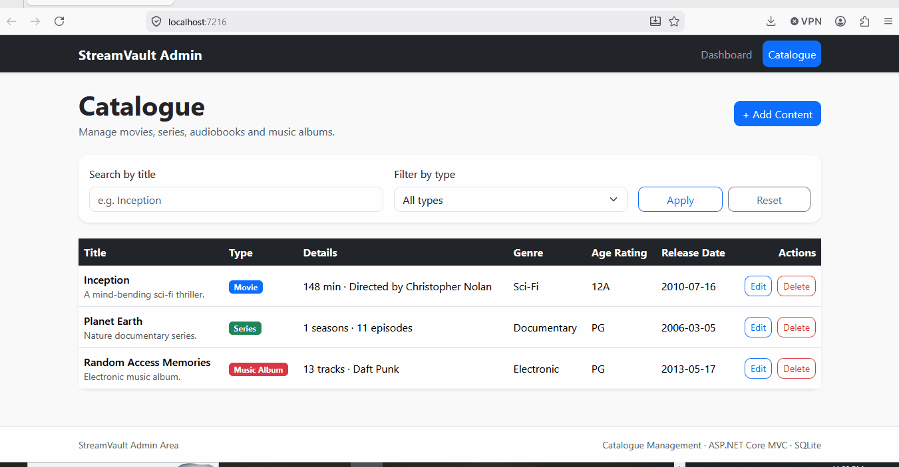

# StreamVault Admin

A simple ASP.NET Core MVC application for managing a streaming platform catalogue containing Movies, Series, Audiobooks, and Music Albums.

## Technology Stack

* ASP.NET Core MVC (.NET 8)
* Entity Framework Core
* SQLite
* Bootstrap 5

## Demo



## Features

### User Interface

* Responsive layout built with Bootstrap 5
* Optimised for desktop, tablet and mobile devices
* Adaptive navigation and content layouts across different screen sizes
* Forms and catalogue views remain usable on smaller screens without horizontal scrolling


### Catalogue Management

* View the complete catalogue
* Search catalogue items by title
* Filter catalogue items by content type
* Create new catalogue entries
* Edit existing catalogue entries
* Delete catalogue entries

### Supported Content Types

#### Movie

* Title
* Description
* Release Date
* Genre
* Age Rating
* Duration (minutes)
* Director

#### Series

* Title
* Description
* Release Date
* Genre
* Age Rating
* Number of Seasons
* Total Episodes

#### Audiobook

* Title
* Description
* Release Date
* Genre
* Age Rating
* Author
* Narrator
* Duration (minutes)

#### Music Album

* Title
* Description
* Release Date
* Genre
* Age Rating
* Artist
* Track Count
* Record Label

### Validation

Validation is implemented on both the server and client side.

Server-side validation uses Data Annotations and custom validation logic where appropriate. Client-side validation is provided through jQuery Validation and Unobtrusive Validation.

Examples include:

* Title is required
* Numeric values must be positive
* Maximum field lengths are enforced where appropriate
* Type-specific fields are validated according to the selected content type
* Invalid submissions return clear validation messages

Server-side validation remains the source of truth and protects the application even if client-side validation is bypassed.

---

## Automated Tests

The solution includes a dedicated test project:

```text
StreamVault.Admin.Tests
```

Current automated tests cover:

* CatalogueFormViewModel validation rules
* CatalogueItemMapper mapping behaviour
* CatalogueService business logic

The tests verify validation behaviour, entity/view-model mapping, and catalogue management functionality.

Run all tests using:

```bash
dotnet test
```

---

## How to Run

### Prerequisites

* .NET 8 SDK

### Steps

1. Clone the repository

```bash
git clone <repository-url>
```

2. Navigate to the solution folder

```bash
cd StreamVault.Admin
```

3. Run the application

```bash
dotnet run
```

or launch directly from Visual Studio.

4. Open the application in your browser.

---

## Database Creation and Seeding

The application uses SQLite and Entity Framework Core.

On application startup:

1. The database is automatically created if it does not exist.
2. Initial sample catalogue data is seeded automatically.

This allows the project to be cloned and run without any manual database setup.

No migrations or SQL scripts are required.

---

## Design Decisions

### Inheritance Strategy

The catalogue contains several content types that share common properties:

* Title
* Description
* Release Date
* Genre
* Age Rating

These shared properties are defined in the abstract base class:

```csharp
CatalogueItem
```

The following classes inherit from it:

```csharp
Movie
Series
Audiobook
MusicAlbum
```

Each derived class contains only its type-specific properties.

This approach keeps the model easy to understand and avoids duplication of common fields.

---

### Persistence Strategy

Entity Framework Core was chosen because:

* It provides strong support for inheritance mapping.
* It reduces boilerplate CRUD code.
* It integrates naturally with ASP.NET Core MVC.
* It is appropriate for a small administrative application.

The inheritance hierarchy is stored using a **Table-Per-Hierarchy (TPH)** strategy.

A discriminator column identifies the concrete content type stored in each row.

Benefits:

* Simple schema
* Easy querying across all catalogue items
* Minimal complexity for a small application

---

### Public Identifiers

Items expose a PublicId that is used in routes instead of database primary keys.

Benefits:

* Cleaner URLs
* Reduced exposure of internal database identifiers
* Easier future migration to distributed systems

---

### Separation of Concerns

* Controllers handle HTTP requests and responses.
* ViewModels are used for user input and UI-specific concerns.
* Entity models represent persisted catalogue data.
* Data access is handled through Entity Framework Core and the application DbContext.

This keeps the application structure simple and maintainable.

---

## Security Considerations

Although authentication is intentionally out of scope for this exercise, several security practices are implemented:

* Anti-forgery token validation on POST actions
* Server-side validation for all user input
* Client-side validation for improved user experience
* Entity Framework Core is used instead of raw SQL, reducing SQL injection risk
* Search functionality is implemented through EF Core LINQ queries
* Razor views automatically HTML-encode output, helping protect against XSS attacks
* Public identifiers are used in routes instead of exposing database primary keys

For a production system, I would additionally implement authentication, authorization, audit logging, security headers, and role-based access control.

## Assumptions

* Authentication is out of scope for this exercise.
* A content item's type is fixed after creation.
* The application is intended for internal administrative use.

---

## What I Would Do Next

Given more time, I would consider:

### Testing

The solution already includes automated unit tests covering validation, mapping, and catalogue service behaviour.

Given more time, I would add:

* Integration tests for controller actions
* End-to-end UI tests
* Additional edge-case coverage

### Service Layer

* Introduce application services to further reduce controller responsibilities
* Centralise content creation and update logic

### User Experience

* Pagination for large catalogues
* Sorting options
* Better filtering capabilities
* Confirmation modals for destructive actions

### Production Readiness

* Logging and monitoring
* Error handling middleware
* Database migrations
* Soft-delete support
* Audit history for catalogue changes

---


## Notes

This solution focuses on correctness, readability, maintainability, and usability. The interface is fully responsive and has been tested across desktop, tablet, and mobile screen sizes.


## Trade-offs

This solution was intentionally kept simple to fit the time-boxed nature of the exercise.

Key trade-offs:

- A single form ViewModel is used to support all content types, reducing duplication and keeping the UI implementation straightforward.
- EF Core TPH inheritance was chosen because it provides simple persistence and querying for a small catalogue management application.
- Business logic is intentionally lightweight and primarily focused on validation and entity mapping.

With more time I would:

- Introduce a dedicated service layer.
- Expand integration test coverage.
- Split type-specific form logic into dedicated editor templates.
- Add pagination and sorting to the catalogue list.
- Improve client-side interactivity.
